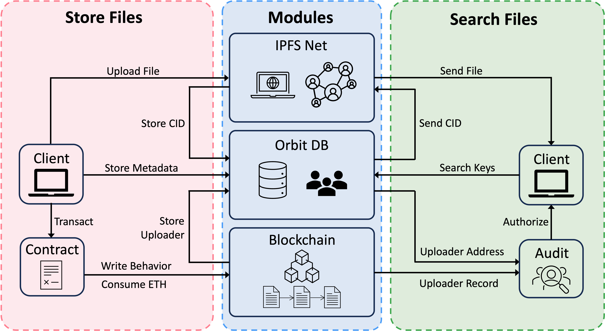

<h1>
  
  IPFS-BlockchainLib
</h1>

## Abstract
This project explores the design and implementation of a decentralized storage system leveraging InterPlanetary File System (IPFS), OrbitDB, and blockchain technology, named IPFS Library. While IPFS offers robust decentralized file storage, its usability is limited by the need to know file-specific Content Identifiers (CIDs) for retrieval. To address this, we integrated OrbitDB to store metadata such as file titles and authors, enabling users to search and retrieve files intuitively. Blockchain technology enhances transparency by recording user actions, such as file uploads and deletions, while a virtual currency mechanism based on Ethereum incentivizes responsible behavior and optimizes resource use. Our system demonstrates an accessible, accountable, and decentralized solution for file storage, advancing the principles of Web3. This project is the HKUST COMP4651 Fall2024 course final project.

<p align="center">
  
</p>

## Installation
Please refer to [INSTALL.md](./demo-installation/INSTALL.md).

## Start IPFS Library
After successful installation, you could start the IPFS by the following instructions.

Open 4 seperate terminals. 

1. For the first terminal, run 
    ```sh
    ipfs daemon
    ```

2. For the second terminal, run 
    ```sh
    node server.mjs
    ```

3. For the third terminal, run 
    ```sh
    anvil
    ```

4. For the fourth terminal, run 
    ```sh
    npm start
    ```

## Demostration
You could refer to the GIFs in [DEMO.md](./demo-installation/DEMO.md)

We also provide YouTube videos for demonstration. 1. [Start IPFS](https://youtu.be/XQlljNCM0ss) 2. [Add blockchain account to Metamask](https://youtu.be/dD1cTx0mD2A) 3. [Upload files to IPFS Library](https://youtu.be/FcKgLwpYbFk) 4. [Swtich accounts and upload files](https://youtu.be/N9z1TKvR_rY) 5. [Search file and delete file](https://youtu.be/8jHJwvBRdlc) Feel free to check them out!